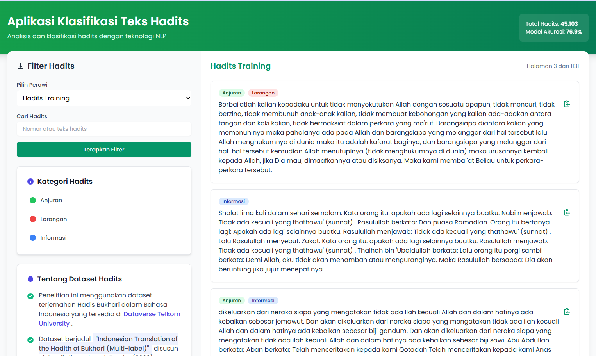

# 📚 Klasifikasi Multi-Label Teks Terjemahan Hadis Shahih Bukhari

### _Menggunakan Metode Logistic Regression Berbasis Gradient Descent_

## 📌 Deskripsi Aplikasi

Aplikasi ini merupakan sistem klasifikasi **multi-label** untuk teks _terjemahan Hadis Shahih Bukhari_ dalam Bahasa Indonesia. Setiap hadis diklasifikasikan ke dalam **tiga kategori utama**:

- ✅ **Anjuran**
- ⛔ **Larangan**
- ℹ️ **Informasi**

Model klasifikasi dibangun menggunakan metode **Logistic Regression** dengan pendekatan **Gradient Descent**, dan diimplementasikan dengan bantuan pustaka seperti `scikit-learn`. Aplikasi ini bertujuan untuk membantu analisis konten hadis dalam konteks tematik tertentu secara otomatis.

🔍 Hasil dari model ini menunjukkan **akurasi sebesar 76,9%** pada data pengujian, menandakan performa yang cukup baik dalam menangani permasalahan klasifikasi multi-label berbasis teks.

## 🖼️ Tampilan Antarmuka

Berikut adalah tampilan antarmuka saat aplikasi dijalankan:



## 📂 Dataset yang Digunakan

Dataset utama berasal dari:

**📁 Indonesian Translation of the Hadith of Bukhari (Multi-label)**

- 📥 Disusun oleh: _Adiwijaya dan Al-Faraby_
- 📅 Tahun: 2023
- 🏫 Sumber: [Dataverse Telkom University](https://dataverse.telkomuniversity.ac.id/dataset.xhtml?persistentId=doi:10.34820/FK2/HDQ1OJ)
- 📎 DOI: `10.34820/FK2/HDQ1OJ`

### ✨ Karakteristik Dataset:

- 🧾 **data_training.csv**: 5.601 data
- 🧾 **data_testing.csv**: 1.401 data
- ✅ Label: `Anjuran`, `Larangan`, `Informasi`
- 📜 Validasi label dilakukan oleh **ahli hadis**
- ➕ Data tambahan dari Kaggle yang mencakup teks Arab, terjemahan, dan nomor hadis
- 📚 Termasuk hadis dari: Bukhari, Muslim, Ahmad, Abu Daud, Tirmidzi, Ibnu Majah, Nasai, Malik, dan Darimi

🙏 **Terima kasih kepada penyusun dan penyedia dataset** atas kontribusi yang sangat berharga untuk kemajuan penelitian dan pengembangan teknologi dalam bidang ilmu keislaman.

## ⚙️ Kebutuhan (Requirements)

Pastikan Anda memiliki Python versi **3.7 atau lebih tinggi**.  
Berikut adalah pustaka yang diperlukan untuk menjalankan aplikasi ini:

```bash
scikit-learn>=0.24
pandas
numpy
matplotlib
```

Instalasi cepat menggunakan `pip`:

```bash
pip install -r requirements.txt
```

## 🚀 Cara Instalasi dan Menjalankan

1. **Clone repository ini**:

```bash
git clone https://github.com/username/nama-repo.git
cd nama-repo
```

2. **Instal semua dependency**:

```bash
pip install -r requirements.txt
```

3. **Letakkan dataset**  
   Unduh file `data_training.csv` dan `data_testing.csv` dari [tautan dataset ini](https://dataverse.telkomuniversity.ac.id/dataset.xhtml?persistentId=doi:10.34820/FK2/HDQ1OJ), lalu simpan ke dalam folder `data/` di root proyek.

4. **Jalankan aplikasi**:

```bash
python main.py
```

## 📈 Output

Setelah menjalankan program, Anda akan mendapatkan:

- Probabilitas klasifikasi untuk setiap label
- Nilai akurasi
- Grafik performa model (jika diaktifkan)

## 📝 Catatan

Aplikasi ini dirancang untuk keperluan penelitian dan edukasi. Penggunaan lebih lanjut diharapkan tetap memperhatikan konteks ilmiah dan etika penggunaan data keagamaan.

## 💬 Ucapan Terima Kasih

Terima kasih kepada:

- **Adiwijaya dan S. A. Faraby** sebagai penyusun dataset
- **Dataverse Telkom University** atas publikasi dataset yang sangat berguna ini

Semoga aplikasi ini bermanfaat dan dapat menjadi dasar bagi penelitian lanjutan dalam bidang NLP keislaman.
